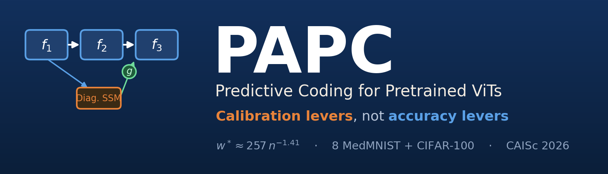
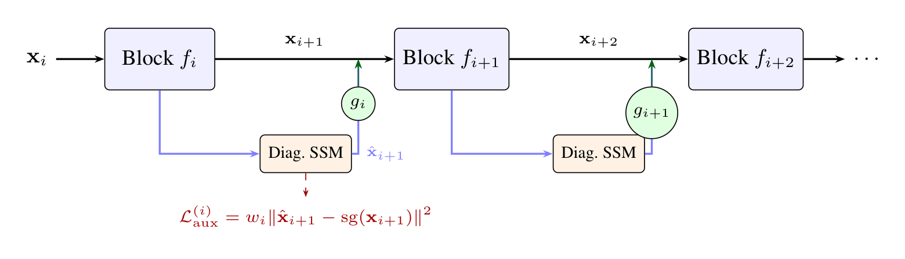
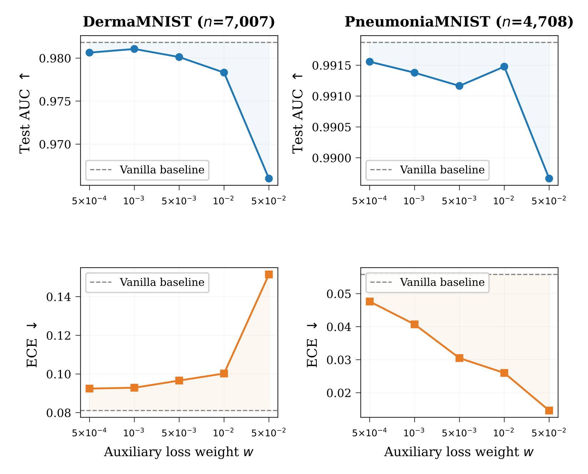
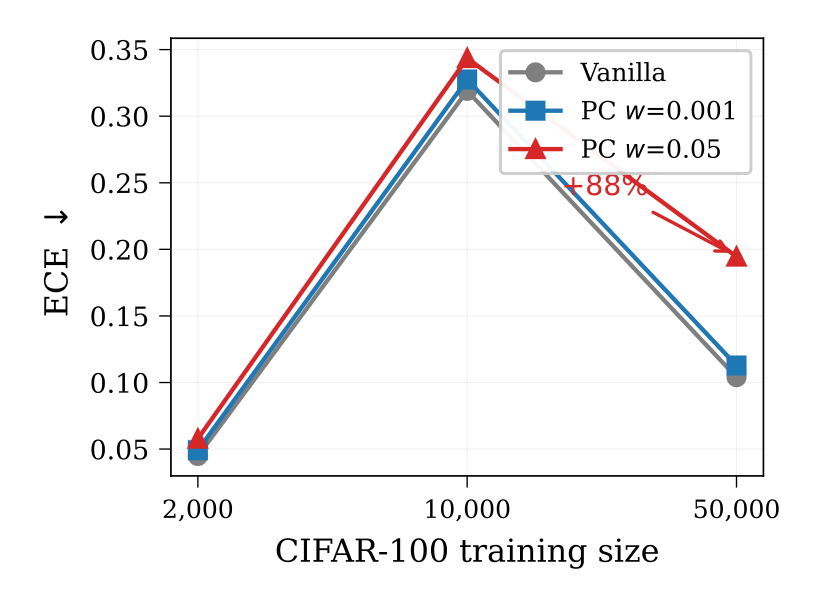
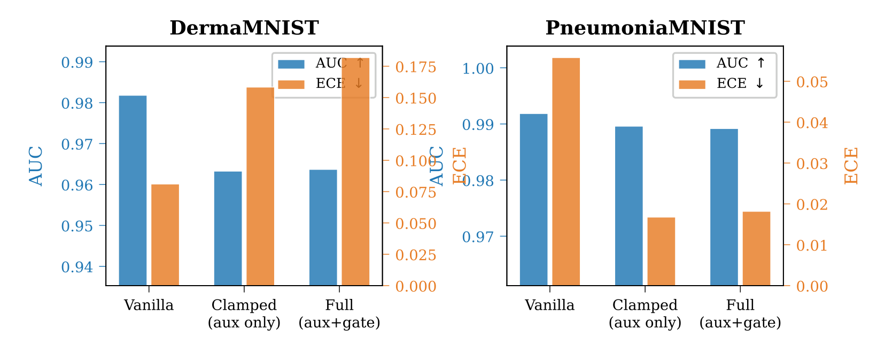
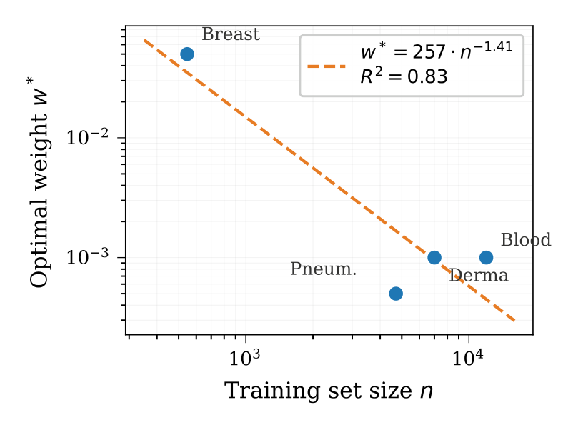

<div align="center">



<h3>Predictive Coding Auxiliary Losses Are Calibration Levers, Not Accuracy Levers</h3>
<i>A Cross-Domain Empirical Study</i> · CAISc 2026

**Khamir Desai**

<p>
<a href="https://openreview.net/forum?id=Kcsv2jUROe"></a>
<a href="https://openreview.net/pdf?id=Kcsv2jUROe"></a>
<a href="paper/CAISc2026_SUBMIT_v3.pdf"></a>
</p>

[](https://openreview.net/forum?id=Kcsv2jUROe)
[](https://www.python.org/)
[](https://pytorch.org/)
[](LICENSE)
[](tests/)

</div>

> **TL;DR** — Attaching a predictive-coding (PC) sidecar to a pretrained ViT does
> **not** improve accuracy. What it *does* do, systematically, is move
> **calibration**. PC auxiliary losses are **calibration levers, not accuracy
> levers** — and the AUC-optimal strength follows a clean **power law in dataset
> size**, `w* ≈ 257·n⁻¹·⁴¹`.

📄 **Paper:** https://openreview.net/forum?id=Kcsv2jUROe &nbsp;·&nbsp; **PDF:** https://openreview.net/pdf?id=Kcsv2jUROe

---

## 🎇 News

- **Sep 2026** — Code, executed notebooks, and the full results release is public. 🎉
- **Sep 2026** — Paper available on [OpenReview](https://openreview.net/forum?id=Kcsv2jUROe) (CAISc 2026).

---

## 📝 Abstract

We investigate whether predictive-coding auxiliary losses can improve pretrained
Vision Transformer classifiers. Attaching a diagonal state-space predictor to
each ViT block and training with an inter-block prediction loss, we run a
controlled study across **eight MedMNIST benchmarks** and **CIFAR-100 at three
dataset sizes**. Our central finding is that **PC losses are calibration levers,
not accuracy levers**: they systematically reshape confidence distributions (ECE)
while leaving discriminability (AUC) nearly unchanged. At the commonly used weight
`w=0.05`, calibration degrades on most datasets — ECE nearly doubles on CIFAR-100
(n=50k) while AUC moves by only 0.02 pp — yet on PneumoniaMNIST the same weight
improves ECE by **3.2×** with negligible AUC cost. We identify a dataset-size
scaling law for the optimal weight, **w\* ≈ 257·n<sup>−1.41</sup>** (R²=0.83), and
show through a gate-clamping ablation that the **auxiliary-loss gradient is the
primary mechanism**. A progressive adaptive variant (**PAPC**) prevents all
catastrophic failures while preserving calibration benefits. As a secondary
finding, vanilla ViT-Base at 224 px already outperforms published specialist
architectures (MedMamba, MedViT) on DermaMNIST by **+4.5 AUC points** and
RetinaMNIST by **+8.3 points**, suggesting training recipes dominate architectural
novelty on these benchmarks.

<div align="center">
<br>
<sub><b>Figure 1.</b> A diagonal SSM predicts each ViT block's output from the previous block's activations. The prediction error is folded back through a learned gate <i>g<sub>i</sub></i> (initialised to zero); the auxiliary loss uses a stop-gradient target. In PAPC, <i>w<sub>i</sub></i> is learnable per layer and cosine-warmed from zero.</sub>
</div>

---

## 📑 Contents

[Key findings](#-key-findings) ·
[Main results](#-main-results-sota-table) ·
[Calibration lever](#️-the-calibration-lever-effect) ·
[Mechanism](#-mechanism-gradient-not-gate) ·
[Scaling law](#-the-scaling-law) ·
[Ablation](#-full-ablation) ·
[Method](#-method) ·
[Layout](#-repository-layout) ·
[Install](#-installation) ·
[Quickstart](#-quickstart) ·
[Reproduce](#-reproduce-the-paper-without-a-gpu) ·
[Training](#️-training) ·
[Inference](#-inference-predict-on-an-image) ·
[API](#-using-the-model-in-your-own-code) ·
[Datasets](#-datasets) ·
[Reproducibility](#️-reproducibility) ·
[Citation](#-citation)

---

## ✨ Key findings

1. **Calibration, not discriminability.** On **PneumoniaMNIST**, sweeping `w` from
   `5e-4` to `5e-2` improves ECE **3.2×** (0.048 → 0.015) while AUC moves ~0.2 pp.
   On **CIFAR-100 (n=50k)** the same weight *nearly doubles* ECE (0.104 → 0.195)
   for a 0.02 pp AUC change. Multi-seed testing finds **no significant AUC gain**
   from PC anywhere (Wilcoxon *p* = 0.72).
2. **A dataset-size scaling law** for the AUC-optimal weight:
   **w\* ≈ 257 · n<sup>−1.41</sup>** (R² = 0.83) — a training-free heuristic.
3. **The auxiliary-loss *gradient* is the mechanism**, not error integration — a
   gate-clamping ablation yields near-identical AUC to the full model.
4. **PAPC prevents catastrophic failures** while matching vanilla ViT on AUC.
5. **Recipe beats architecture (secondary):** plain ViT-Base @ 224 px already
   beats MedMamba/MedViT on several datasets (+4.5 AUC pts DermaMNIST, +8.3 RetinaMNIST).

> 🧭 This work began as a *failed* hypothesis (PC would boost accuracy). Rigorous
> refutation is what surfaced the calibration-lever finding.

---

## 🏆 Main results (SOTA table)

Test **AUC** (mean ± std over 3 seeds), ViT-Base @ 224 px. `V>Pub` marks where the
*vanilla* baseline already beats the best published specialist. Regenerate with
`python scripts/analyze_results.py`.

| Dataset          |     n | Vanilla | HP (w=0.05) | PAPC | Best published | V > Pub |
|------------------|------:|:-------:|:-----------:|:----:|:--------------:|:-------:|
| PathMNIST        | 89 996 | 0.9976 | 0.9915 | 0.9976 | 0.999 | |
| OrganAMNIST      | 34 561 | 0.9962 | 0.9962 | 0.9957 | 0.998 | |
| OrganCMNIST      | 12 975 | 0.9875 | 0.9858 | 0.9881 | 0.997 | |
| BloodMNIST       | 11 959 | 0.9993 | 0.9991 | 0.9994 | 0.999 | ✅ |
| DermaMNIST       |  7 007 | **0.9818** | 0.9637 | 0.9806 | 0.937 | ✅ **+4.5 pts** |
| PneumoniaMNIST   |  4 708 | 0.9919 | 0.9892 | 0.9907 | 0.995 | |
| RetinaMNIST      |  1 080 | 0.8566 | 0.8612 | 0.8602 | 0.773 | ✅ **+8.3 pts** |
| BreastMNIST      |    546 | 0.8175 | 0.8594 | 0.8315 | 0.938 | |

**PAPC ≈ Vanilla** on AUC everywhere (PC buys no discriminability), while naive
**HP w=0.05 can *hurt*** (DermaMNIST 0.982 → 0.964) — a failure PAPC avoids.

---

## 🎚️ The calibration-lever effect

<div align="center">
<br>
<sub><b>Figure 2.</b> AUC (top) and ECE (bottom) vs. auxiliary weight <i>w</i>. On DermaMNIST larger <i>w</i> <b>worsens</b> ECE; on PneumoniaMNIST it <b>improves</b> ECE 3.2× — while AUC stays essentially flat on both. Same lever, opposite sign.</sub>
</div>

<br>

<div align="center">
<br>
<sub><b>Figure 3.</b> On CIFAR-100, <i>w</i>=0.05 degrades calibration (+88% ECE at n=50k) for a negligible AUC change.</sub>
</div>

This is exactly why a **dataset-size-aware weight** matters — the sign of the
effect flips across datasets.

---

## 🔬 Mechanism: gradient, not gate

<div align="center">
<br>
<sub><b>Figure 5.</b> Gate-clamping ablation at <i>w</i>=0.05. <b>Clamped</b> keeps the auxiliary loss but forces the error-integration gate off; <b>Full</b> keeps both. Clamped ≈ Full on AUC ⇒ the effect is driven by the <b>loss gradient</b>, not by adding the error back in.</sub>
</div>

| Dataset | Condition | AUC | ECE | |
|---|---|:-:|:-:|---|
| DermaMNIST | vanilla | 0.9818 | 0.0811 | baseline |
| DermaMNIST | full (aux + integration) | 0.9637 | 0.1820 | |
| DermaMNIST | **clamped (aux only)** | **0.9633** | 0.1584 | AUC ≈ full |
| PneumoniaMNIST | vanilla | 0.9919 | 0.0558 | baseline |
| PneumoniaMNIST | full (aux + integration) | 0.9892 | 0.0182 | |
| PneumoniaMNIST | **clamped (aux only)** | **0.9896** | 0.0168 | AUC ≈ full |

---

## 📈 The scaling law

<div align="center">
<br>
<sub><b>Figure 4.</b> The AUC-optimal weight vs. training-set size across four MedMNIST datasets.</sub>
</div>

$$\boxed{\,w^* \approx 256.7 \cdot n^{-1.412}\,}\qquad R^2 = 0.831$$

| Dataset | BreastMNIST | PneumoniaMNIST | DermaMNIST | BloodMNIST |
|---|:-:|:-:|:-:|:-:|
| n | 546 | 4 708 | 7 007 | 11 959 |
| AUC-optimal `w*` | 0.05 | 0.0005 | 0.001 | 0.001 |

A practical rule of thumb for choosing the auxiliary weight from dataset size
alone, with no extra training.

---

## 🧪 Full ablation

Six-condition ablation (AUC / ECE, 3 seeds). All *calibrated* variants land within
noise of vanilla on AUC; only naive fixed `w=0.05` swings wildly.

| Dataset | vanilla | fixed 0.05 | fixed 0.001 | prog 0.005 | adaptive | **PAPC** |
|---|:-:|:-:|:-:|:-:|:-:|:-:|
| DermaMNIST (AUC) | 0.9818 | 0.9637 | 0.9800 | 0.9796 | 0.9798 | **0.9806** |
| DermaMNIST (ECE) | 0.0811 | 0.1820 | 0.0938 | 0.0894 | 0.0891 | **0.0897** |
| PneumoniaMNIST (AUC) | 0.9919 | 0.9892 | 0.9912 | 0.9911 | 0.9918 | **0.9907** |
| PneumoniaMNIST (ECE) | 0.0558 | 0.0182 | 0.0438 | 0.0368 | 0.0404 | **0.0466** |
| BloodMNIST (AUC) | 0.9993 | 0.9991 | 0.9994 | 0.9994 | 0.9994 | **0.9994** |
| BreastMNIST (AUC) | 0.8175 | 0.8594 | 0.8405 | 0.8365 | 0.8342 | **0.8315** |

---

## 🧠 Method

Given a pretrained ViT with blocks $f_1,\dots,f_L$, a **Predictive Coding Layer**
sits after each block. A per-channel **diagonal SSM** predicts the next block's
output from the current activations; the error is optionally folded back through a
**learned gate** $g_i$ initialised to zero — so an untrained model is *identical*
to the plain backbone ($\tanh(0)=0$).

```
x_{i+1}  = f_i(x_i)                                     # block output
x̂_{i+1} = SSM(LayerNorm(x_i))                           # PC prediction
x̃_{i+1} = x_{i+1} + tanh(g_i) · W_i · LN(x_{i+1} − x̂_{i+1})   # gated integration (optional)
L_aux    = Σ_i w_i · ‖ x̂_{i+1} − stopgrad(x_{i+1}) ‖²   # auxiliary loss
L        = L_task + L_aux
```

The SSM is a **causal depthwise convolution** — numerically equal to the linear
recurrence to ~2×10⁻⁷, but one `conv1d` instead of a loop.

**Variants** (all flags on the same `PAPCViT` class):

| Variant | Weight $w_i$ | Flags |
|---|---|---|
| vanilla | — (no PC) | `use_pc=False` |
| fixed | constant `w` | `pred_loss_weight=w` |
| progressive | `w · ½(1 − cos πt)` | `progressive=True` |
| adaptive | `softplus(θ_i) · w_max` (learned) | `adaptive=True` |
| **PAPC** | learned **and** cosine-warmed | `adaptive=True, progressive=True` |
| gate-clamped | fixed `w`, integration off | `clamp_gate=True` |

Full equations ↔ code mapping in [`docs/METHOD.md`](docs/METHOD.md).

---

## 📂 Repository layout

```
papc-vit/
├── papc/                  # installable package — single source of truth
│   ├── model.py           #   DiagonalSSM, PCLayer, PAPCViT (all variants)
│   ├── data.py            #   MedMNIST/CIFAR loaders, transforms, EMA, metrics, ECE
│   ├── train.py           #   train_eval: fine-tune + evaluate (+ checkpoint save)
│   ├── config.py          #   per-dataset HPs, published baselines, conditions
│   └── experiments.py     #   the four sessions (A/B/C/D) + scaling-law fit
├── scripts/
│   ├── run_experiments.py #   train: run a session or an ad-hoc grid
│   ├── predict.py         #   inference on a single image from a checkpoint
│   ├── analyze_results.py #   regenerate paper tables from results/ (no GPU)
│   ├── make_figures.py    #   regenerate result figures (no GPU)
│   └── make_banner.py     #   regenerate the README banner
├── notebooks/             # original, fully executed submission notebooks
├── results/               # raw metrics JSON from the paper runs (+ schema README)
├── paper/                 # CAISc 2026 manuscript PDF
├── assets/                # banner + figures (assets/paper/ = extracted from PDF)
├── docs/METHOD.md         # equations ↔ code
├── reproducibility/       # hardware / software / run notes
└── tests/                 # CPU smoke tests (no downloads, no GPU)
```

---

## 📦 Installation

```bash
git clone https://github.com/Eartherai/papc-vit.git
cd papc-vit
pip install -e ".[dev]"          # editable install + pytest
# or, without installing the package:
pip install -r requirements.txt
```

**Requirements:** Python ≥ 3.9, PyTorch ≥ 2.1, `timm` ≥ 1.0, `medmnist` ≥ 3.0,
`scikit-learn`, `numpy`, `pandas`, `matplotlib`, `scipy`, `pillow`. A CUDA GPU is
needed only to **train**; analysis, figures, inference, and tests are CPU-only.

---

## 🚀 Quickstart

```bash
# Reproduce the paper's tables from the checked-in results (no GPU)
python scripts/analyze_results.py --results-dir results

# Rebuild the figures / banner (no GPU)
python scripts/make_figures.py --results-dir results --out-dir assets
python scripts/make_banner.py

# Run the CPU smoke tests
pytest -q

# Train a quick single-dataset check (needs a CUDA GPU)
python scripts/run_experiments.py --dataset pneumoniamnist \
    --conditions vanilla fixed:0.05 papc --seeds 1 --output-dir results_repro
```

Equivalent `make` targets: `make analyze`, `make figures`, `make test`, `make smoke-gpu`.

---

## 🔁 Reproduce the paper without a GPU

Every headline number is regenerated from the JSON in [`results/`](results/):

```bash
python scripts/analyze_results.py --results-dir results
```

<details>
<summary>expected output (abridged)</summary>

```
SOTA TABLE  (test AUC, mean over seeds)
pathmnist          89996     0.9976±0.0004     0.9915±0.0009     0.9976±0.0003     0.999
dermamnist          7007     0.9818±0.0004     0.9637±0.0081     0.9806±0.0005     0.937     yes
retinamnist         1080     0.8566±0.0158     0.8612±0.0039     0.8602±0.0057     0.773     yes

GATE-CLAMPING ABLATION
dermamnist       full_005       0.9637     0.1820  aux+integration
dermamnist       clamped        0.9633     0.1584  aux only          <- AUC ~ identical

DATASET-SIZE SCALING LAW
  w* = 256.7 * n^(-1.412)   (R^2 = 0.831)
```
</details>

---

## 🏋️ Training

Each paper session is **resumable** and **time-budgeted** — re-running skips
completed (dataset, condition, seed) triples and stops gracefully near the budget.
MedMNIST/CIFAR download automatically on first use.

```bash
# a full paper session (A / B / C / D)
python scripts/run_experiments.py --session A --output-dir results_repro
```

| Session | What it runs | Output keys |
|:-:|---|---|
| **A** | Main SOTA table — vanilla / fixed `w=0.05` / PAPC across 8 datasets | `sota` |
| **B** | Full 6-condition ablation + gate-clamping mechanism ablation | `ablation`, `clamp` |
| **C** | CIFAR-100 cross-domain sizes + weight sweep + scaling-law fit | `cifar`, `sweep`, `scaling_law` |
| **D** | 5-seed runs (tight CIs) + learned per-layer weight extraction | `extended`, `learned_weights` |

Ad-hoc grid on a single dataset, **saving checkpoints** for inference:

```bash
python scripts/run_experiments.py --dataset dermamnist \
    --conditions vanilla fixed:0.05 clamped:0.05 papc \
    --seeds 3 --save-models checkpoints --output-dir results_repro
```

Condition syntax: `vanilla`, `fixed:<w>`, `prog:<w>`, `adaptive`, `papc`, `clamped:<w>`.

---

## 🔮 Inference (predict on an image)

Train with `--save-models DIR` (above), then classify any image with the saved
checkpoint — CPU is fine:

```bash
python scripts/predict.py \
    --checkpoint checkpoints/dermamnist_papc_s0.pt \
    --image path/to/image.png --topk 3
```

```
Prediction: class 5  (confidence 0.8123)
Top-k:
  class  5  0.8123  ████████████████████████
  class  1  0.0904  ███
  class  0  0.0431  █
```

The reported **confidence** is exactly the quantity this paper shows PAPC reshapes.

---

## 🧩 Using the model in your own code

```python
import torch
from papc import PAPCViT, mk_papc

# PAPC = progressive + adaptive per-layer weights (the proposed method)
model = PAPCViT(num_classes=8, in_chans=3, **mk_papc())

logits, aux_loss = model(torch.randn(4, 3, 224, 224))
loss = your_task_loss(logits, targets) + aux_loss   # just add the aux term

model.set_progress(step, total_steps)   # drives the cosine warmup
model.gate_values()                      # per-layer tanh(gate)
model.learned_weights()                  # per-layer w_i (PAPC only)
```

Condition factories in [`papc/config.py`](papc/config.py): `mk_vanilla`,
`mk_fixed(w)`, `mk_prog(w)`, `mk_adaptive`, `mk_papc`, `mk_clamped(w)`.

---

## 📊 Datasets

| Source | Datasets | Access |
|---|---|---|
| [MedMNIST v2](https://medmnist.com/) | Path, Blood, Derma, Breast, Pneumonia, Retina, OrganA, OrganC | auto-downloaded via `medmnist` |
| CIFAR-100 | n = 2 000 / 10 000 / 50 000 sub-samples | auto-downloaded via `torchvision` |

All images are upsampled to **224 px** for the ImageNet-pretrained ViT-Base
backbone (`vit_base_patch16_224.augreg_in21k_ft_in1k`). No dataset is
redistributed here — please observe the MedMNIST and CIFAR licenses.

---

## ♻️ Reproducibility

- **Hardware:** NVIDIA A100 (40 GB & 80 GB), ~60 GPU-hours across four sessions.
- **Software:** Python 3.11, PyTorch, timm ≥ 1.0, medmnist, scikit-learn, numpy,
  pandas, matplotlib, scipy, pillow.
- **Seeds:** 3 (Sessions A/B), 2 (Session C sweeps), 5 (Session D tight CIs).
- **Precision:** bf16 autocast where available, TF32 matmul, cuDNN autotune.
- **Recipe:** AdamW + layer-wise LR decay (0.75), 5% warmup → cosine, EMA (0.9995),
  Mixup/CutMix on multi-class, test-time h-flip averaging.

See [`reproducibility/`](reproducibility/), [`docs/METHOD.md`](docs/METHOD.md),
[`notebooks/`](notebooks/), and [`results/README.md`](results/README.md) (JSON schema).

---

## 💞 Citation

```bibtex
@inproceedings{desai2026papc,
  title     = {Predictive Coding Auxiliary Losses Are Calibration Levers,
               Not Accuracy Levers: A Cross-Domain Empirical Study},
  author    = {Khamir Desai},
  booktitle = {1st Conference for AI Scientists (CAISc)},
  year      = {2026},
  url       = {https://openreview.net/forum?id=Kcsv2jUROe}
}
```

---

## 📄 License

Code is released under the [MIT License](LICENSE). The manuscript PDF and the
datasets retain their respective licenses.

<div align="center">
<br>
<sub>📄 <a href="https://openreview.net/forum?id=Kcsv2jUROe">Paper on OpenReview</a> · CAISc 2026 · built from the original submission notebooks</sub>
</div>
